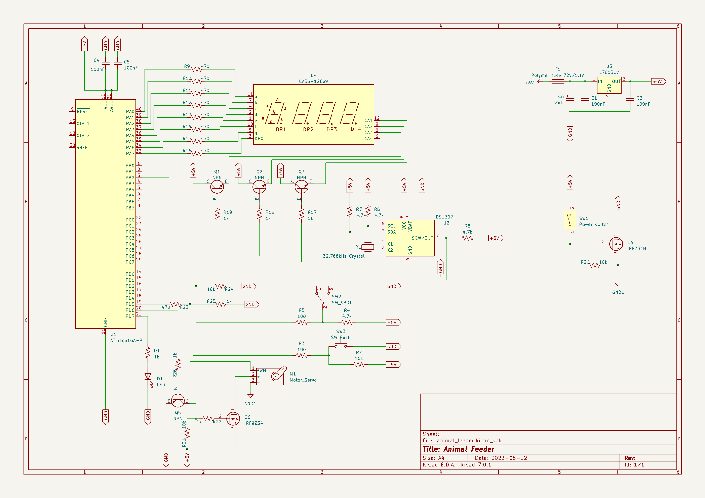
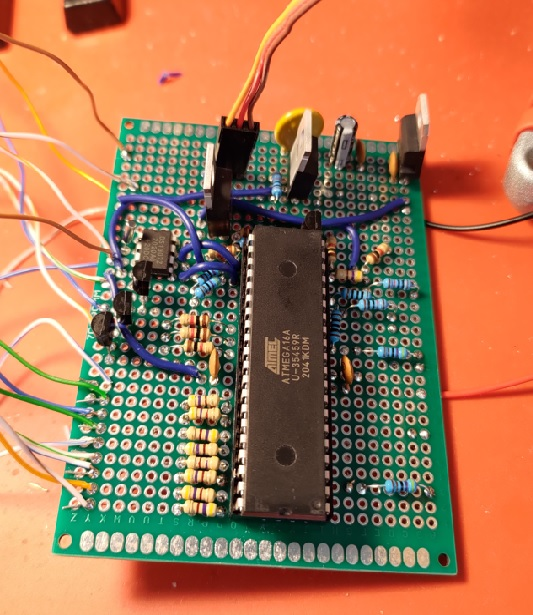
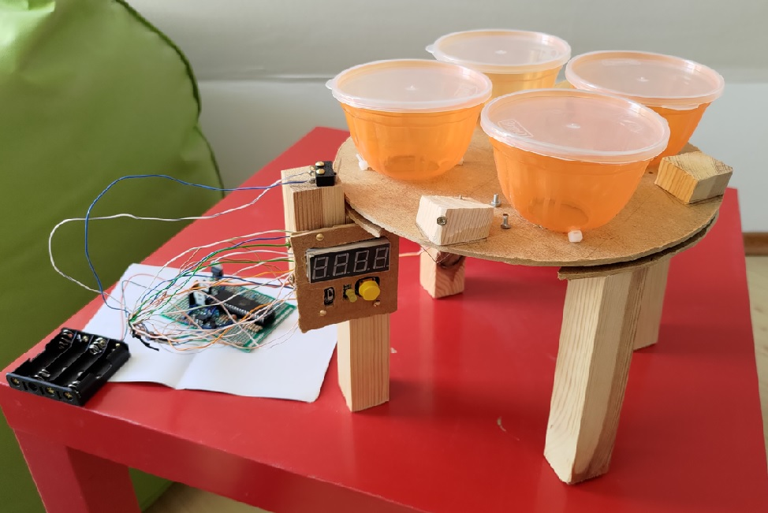

# Pet feeder

This repository contains code for a pet feeding device.  
In the form in which I built it, it can be used to feed small or medium sized animals, like cats. The idea is, that it should enable the owners to leave their pets home alone for up to 40 hours without worrying, that they would get hungry. 

## Functionalities

- can be filled with 4 portions of food,
- one portion is served every 8 hours,
- powered by 4 AA batteries,
- shows how much time is left to the next portion on a 7 segment display,
- can be interacted with using a press button:
    - 1x press - shows the time left to the next portion,
    - 2x press - resets the 8-hour countdown,
    - 3x press - turns on the test mode, in which portions are served every 10 seconds.
- LED indicating:
    - countdown reset - blinks two times (on the first and third second),
    - an error - blinks every second,
    - test mode - is on continuously.
- the food serving mechanism stops when a limit swtich gets triggered or the mechanism has been running for more than 5 seconds, in the latter case something must've gone wrong, therefore an error is indicated, 
- can be turned on/off using a slide switch.

## Schematic

## Components

- AVR ATmega16A-PU
- 26 resistors
- 5 capacitors (4 ceramic, 1 electrolytic)
- Resettable fuse 72V/1,1A
- Voltage stabilizer 5V L7805CV
- 6 transistors (4 bipolar NPN, 1 N-MOSFET, 1 P-MOSFET)
- Servo PowerHD AR-3606HB, 360 degrees
- 7-segment display x4
- RTC clock DS1307
- Quartz resonator 32,768kHz
- Monostable button
- Slide switch
- Limit switch
- Cell holder for 4 AA batteries
- Yellow LED

## Photos

Every 8 hours the disc turns until one of the square wood pieces triggers the limit switch, when that happens, food falls out through a trapdoor, which is underneath every container.